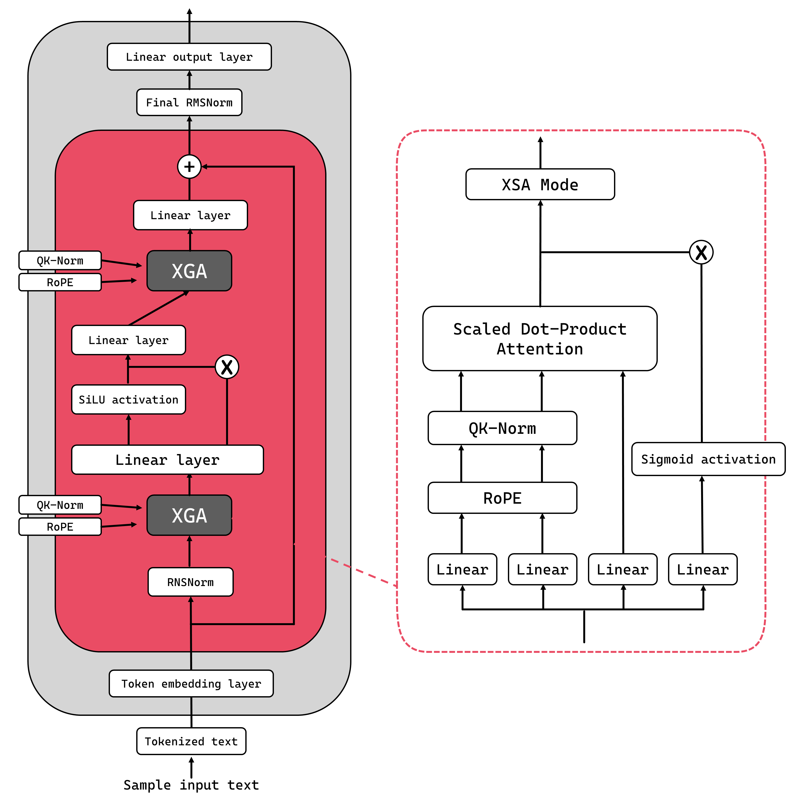
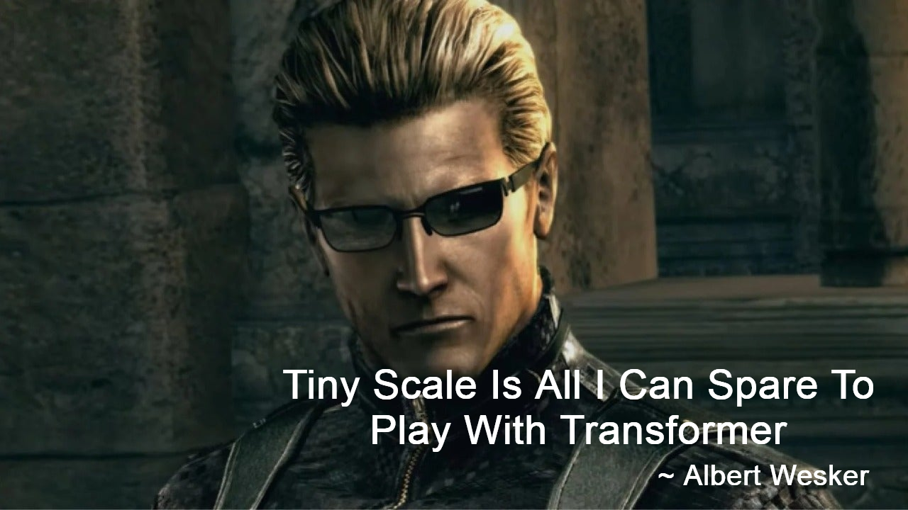

# Tiny Scale Is All I Can Spare To Play With Transformer.
Srijan Srivastava

India

Srivastavavsrijan321@gmail.com

QCoreNest@gmail.com

v2, June 2026


## Abstract
Introduction of the Transformer neural network architecture in the famous `Attention Is All You Need` paper has created a huge wave of AI development in recent years. The scaled dot-product attention allows for information to be processed with higher efficiency and quality, which the previous RNN-based models lacked. However Transformer-based models comes with their own set of challenges, particularly with parameter efficiency for tiny scale models. At such tiny scale a Transformer model essentially uses more parameter than it really should. This regeim is very underexplored and for good reasons however exploring it might allow us to discover interesting insights about the Transformer. So here-in this paper I am introducing Silia, a novel neural network architecture designed for efficient modelling & classification tasks under severe parameter budget. Training against Andrej Karpathy's nanoGPT, Silia achieves comparable loss and generation quality with significantly less parameters. Along with when a 117M parameters model even after being undertrained on a ~100M tokens of synthetic dataset, Silia achieves losses similar to what scaling loss predict for a Transformer based 117M parameters model trained on ~100M tokens.


## 1. Introduction
The dominant trend in Transformer-based language models has been scaling: larger models, more data, more compute in pretraining and RL for CoT based reasoning capabilities to consistently yield better performance. This means that the smallest practical models such as Qwen, Gemma & GPT-OSS lie anywhere between 1B-20B parameters. Despite them being called "small", these models are still billions in parameters and are trained on trillions of tokens. This trajectory, as useful as it is, has widened the gap between general-purpose frontier research experiments and task-specific small research experiments.

This is where I introduce my neural network architecture which merges the _Attention_ layer with the _SwiGLU Feed Forward_ layer from the Transformer to save lots of parameters while preserving much of the original performance. This new architecture is what I call __Silia__ or __Silu in Attention__. **Silia** aims to reduce the number of parameters per block, especially at much smaller scale (100 million parameters or less) while achieving competitive performance and quality as a standard Transformer.


## 2. Related Works
### 2.1. Parameter Reduction
**Weight tying** is a technique where certain weights in the model are shared between different components. This approach not only reduces the total number of parameters but also ensures that certain parts of the model are better aligned. There are different types of weight tying used in various models:
- **Embedding & Head**: In **GPT-2** and other similar models, the embedding matrix is tied to the weights of the output layer, ensuring that the output probabilities are directly related to the input embedding.
- **FFN sharing**: **MobiLlama** shares weights specifically between the feed-forward network (FFN) layers. By doing so, it achieves parameter efficiency without compromising on the model’s ability to learn and generalize.
- **FFN+Attn sharing**: **ALBERT** employs weight tying extensively by sharing parameters across all layers of the transformer. It ties the weights of both the feed-forward network (FFN) and the attention layers, which significantly reduces the model size while maintaining performance.

**Pruning** involves removing weights that contribute least to the model’s performance. This can be done during or after training. Pruning results in a sparser model with fewer parameters and reduced computational requirements. This is inspired by the lottery ticket hypothesis which states that there exists a smaller subnetwork (a "winning ticket") that, when trained in isolation, can achieve performance comparable to the original model. Pruning methods inspired by this hypothesis identify and retain only the most critical parameters.

**Quantization** reduces the precision of the model’s weights and activations from 32-bit floating-point numbers to lower-bit representations such as 8-bit integers. This technique significantly reduces model size (if not parameter count) and often speeds up training/inference with minimal impact on performance.

**Low-Rank Factorization** is a technique which decomposes large weight matrices into products of smaller matrices, which reduces the number of parameters and the computational cost. This has been used in e.g. Ma et al. for compressing a pretrained BERT model.

**Smaller FFN Dimension** reduces the width of the feedforward network, which reduces the number of parameters and computational cost. For instance, in OpenAI's paper _Language Models are Unsupervised Multitask Learners_ the team used a 4x expansion for the FFN dimensions compared to the embedding dimensions, while in Meta's paper _The Llama 3 Herd of Models_, the Llama Team used a 3.5x expansion for the FFN dimensions compared to the embedding dimensions which resulted in reduced parameter count of the overall model which having very competitive performance.

### 2.2. Tiny Scale Language Models
Ronen Eldan and Yuanzhi Li in their paper _TinyStories: How Small Can Language Models Be and Still Speak Coherent English?_ showed that models below 10 million total parameters or much simpler architectures such (with only one Transformer block) produces fluent and consistent stories with several paragraphs that are diverse and have almost perfect grammar, and demonstrate reasoning capabilities when trained on a synthetic dataset of short stories that only contain words that a typical 3 to 4-year-olds usually understand, generated by GPT-3.5 and GPT-4.


## 3. Training
### 3.1. Training Dataset
For demonstration I used 5 different datasets. _webtext-super-tiny_, _email-datasets-20k_, _ChatAlpaca-20k_, _synth-100M_ and _FIneweb-edu-100M_:
- **Webtext Super Tiny** is a light-weight English-only dataset containing texts from **Wikipedia**, **fandoms**, **storylines**, **story dialogues** of various games, **transcripts of various YouTube videos**, **research papers**, **academic articles** and **blogs** (topic mainly revolving around AI and LLMs in general) and code from some of my **personal code bases** and other **publicly available repositories**. The code included in the dataset contains mostly **Python**, **C#**, **C++** and **JavaScript**. The dataset contains ~$10M$ tokens in total.
- **Email-dataset-20k** contains 20k samples of synthetically generated business emails using **Gemma 3-4B-it** (via mlx-community/gemma-3-4b-it-4bit-DWQ). The dataset contains ~$5.5M$ tokens in total.
- **ChatAlpaca-20k** is a chat dataset that aims to help researchers develop models for instruction-following in multi-turn conversations. The dataset is an extension of the Stanford Alpaca data, which contains multi-turn instructions and their corresponding responses. This dataset uses ChatGPT (`GPT-3.5-turbo`) to generate follow-up utterances and continue the conversation with ChatGPT. This process results in multi-turn conversations where the simulated user provides instructions and ChatGPT responds accordingly.
- **Synth-100M** is a is a sampled subset of PleIAs/SYNTH containing approximately **109,149,965 tokens**. This dataset includes diverse synthetic tasks like **Memorization** (Question-answering with Wikipedia context), **MCQ** (Multiple choice questions), **Creative Writing** (Poetry, stories, creative prompts), **Math Exercise** (Word problems with step-by-step solutions), **RAG** (Retrieval-augmented generation tasks), **Constrained Writing** (Writing with specific constraints), **Editing** (Text editing and improvement tasks). This dataset contains approximately 80% English with multilingual content in Spanish, German, French, Polish, Italian, Dutch, Latin and more.
- **Fineweb-edu-100M** is sampled from HuggingFaceFW/fineweb-edu containing curated educational web resources. This dataset was created using **reservoir sampling**, a statistically unbiased random sampling algorithm that guarantees each sample from the source dataset has an equal probability of being included. This ensures the 100M token sample is representative of the full dataset's characteristics.

### 3.2. Training Hardware

|                  | Intel i3-2120         | Tesla M60 | H100 |
| ---------------- | --------------------- | --------- | ---- |
| teraFlops (FP32) | ~0.2 (as per ChatGPT) | ~15       | 67   |
| RAM/VRAM (GB)    | 8                     | 8         | 80   |

Tesla M60 and H100 were made available thanks to the paper sponsor Tomi Yang.


## 4. Silia (Silu In Attention)
### 4.1. Model Architecture


### 4.2. Mathematical Formulation
#### 4.2.1. SwiGLU
SwiGLU was introduced and used by Google in their (N Shazeer, 2020) paper _GLU Variants Improve Transformer_. Prior to this, the standard Transformer architecture heavily relied on simpler activations like ReLU or GeLU. The paper demonstrated that replacing standard feed-forward network layers with Gated Linear Units (GLUs), specifically those utilizing the _Swish_ activation function (SwiGLU) significantly improved training convergence and downstream model accuracy. Since then SwiGLU has been a popular choice for researchers to use in their Transformer models.

$$\text{SwiGLU}(X) = (\text{SiLU}(XW_1) \odot XW_2)W_3$$

$$\text{SiLU}(XW_1) = XW_1 \cdot \sigma(XW_1) = \frac{XW_1}{1 + e^{-XW_1}}$$

Here, $X$ is the hidden state of our input from previous layer. $W_1$ & $W_2$ are linear matrices. $W_3$ is the output projection matrix. $\odot$ is the element-wise multiplication operation. $\sigma$ is the sigmoid activation function.

$X$ usually has a shape _(B, T, C)_. $W_1$ & $W_2$ has a shape _(C, 4*C)_ each and $W_3$ has a shape _(4*C, C)_. Where `B` is batch size, `T` is sequence length and `C` is the embedding dimension.

#### 4.2.2. Self-Attention
Attention is the heart of Transformer and it needs no introduction.

$$Q = XW_Q, K=XW_K, V=XW_V$$

$$A = \mathrm{softmax} \left(\frac{QK^\top}{\sqrt{d_k}} + M\right)V$$

$$\text{Y} = \text{A}W_O$$

The above equation is what was introduced in the now famous _Attention Is All You Need_ paper. This is the equation which is used for autoregressive language modelling where  $W_Q$ is the query matrix, $W_K$ is key matrix, $W_V$ is value matrix, $W_O$ is output projection matrix, $M$ is a causal attention mask and $d_k$ is dimension of the key vectors.

#### 4.2.3. Gated Attention
Gated attention was introduced by Qwen Team in their paper _Gated Attention for Large Language Models: Non-linearity, Sparsity, and Attention-Sink-Free_ where they showed the simple modification-applying a head-specific sigmoid gate after the Scaled Dot-Product Attention (SDPA) consistently improved performance. The modification also enhanced training stability, tolerated larger learning rates and improved scaling properties. Notably, it was also found that this sparse gating mechanism mitigates the `attention sink` and enhances long-context extrapolation performance.

$$Q = XW_Q, K=XW_K, V=XW_V, G=XW_G$$

$$A = \mathrm{softmax} \left(\frac{QK^\top}{\sqrt{d_k}} + M\right)V$$

$$O = \text{A} \odot \sigma(G)$$

$$Y = OW_O$$

Here, $\sigma$ is the sigmoid activation function, $G$ is a linear transformation over our hidden state $X$ which is passed into our sigmoid activation function. 

#### 4.2.4. Exclusive Self Attention (XSA)
_Exclusive Self Attention_ introduced by Shuangfei Zhai was widely adopted in many leading solutions in OpenAI's parameter golf challenge. It is a simple modification of self attention that constrains attention to capture only information orthogonal to the token's own value vector (thus excluding information of self position), encouraging better context modeling, improving Transformer's sequence modeling performance.

Let's see what it looks like in code.

```python
# causal self-attention; Self-attend: (B, nh, T, hs) x (B, nh, hs, T) -> (B, nh, T, T)
y = torch.nn.functional.scaled_dot_product_attention(q, k, v, attn_mask=None, is_causal=True)

# XSA mode
# https://arxiv.org/pdf/2603.09078
vn = torch.nn.functional.normalize(v, dim=-1)
z = y - (y * vn).sum(dim=-1, keepdim=True) * vn

# re-assemble all head outputs side by side
out = z.transpose(1, 2).contiguous().view(B, T, -1)

# output projection
return self.out(out)
```

#### 4.2.5. Exclusive Gated Attention (XGA)
Combining both Gated Attention and Exclusive Self Attention we get Exclusive Gated Attention.

$$Q = XW_Q, K=XW_K, V=XW_V, G=XW_G$$

$$A = \mathrm{softmax} \left(\frac{QK^\top}{\sqrt{d_k}} + M\right)V$$

$$O = \text{A} \odot \sigma(G)$$

$$Y = \text{XSA}(O)$$

_Exclusive Gated Attention_ brings the best of both worlds.

Let's see what _XGA_ looks like in code (including RoPE and QK-Norm).

```python
B, T, C = x.size() # batch size, sequence length, embedding dimensionality (n_embd)

# calculate query, key, values for all heads in batch and move head forward to be the batch dim
q, k, v, g = self.qkv(x).view(B, T, self.n_head, -1).chunk(4, dim=-1)

# apply rotary embeddings to queries and keys to get relative positional encoding
cos, sin = cos_sin
q, k = apply_rotary_emb(q, cos, sin), apply_rotary_emb(k, cos, sin) # QK rotary embedding
q, k = norm(q), norm(k) # QK norm

# make head be batch dim, i.e. (B, T, nh, hs) -> (B, nh, T, hs)
q, k, v, g = q.transpose(1, 2), k.transpose(1, 2), v.transpose(1, 2), g.transpose(1, 2)

# causal self-attention; Self-attend: (B, nh, T, hs) x (B, nh, hs, T) -> (B, nh, T, T)
y = torch.nn.functional.scaled_dot_product_attention(q, k, v, attn_mask=None, is_causal=True)

# apply gated attention
# https://arxiv.org/pdf/2505.06708
y = y * F.sigmoid(g)

# XSA mode
# https://arxiv.org/pdf/2603.09078
vn = torch.nn.functional.normalize(v, dim=-1)
y = y - (y * vn).sum(dim=-1, keepdim=True) * vn

# re-assemble all head outputs side by side
return y.transpose(1, 2).contiguous().view(B, T, -1)
```

#### 4.2.6. Silia
Now as we've been through both SwiGLU and Attention, let's get into the mathematics of **Silia**. We will use our new __Exclusive Gated Attention__ mechanism. We will refer to it as $XGA$ in our mathematical formulation which will take our hidden state $X$ as an input.

Now, first we'll calculate attention over the hidden state $X$.

$$O = \text{XGA}(\text{RMSNorm}(X))$$

$$U = OW_U, V = OW_V \tag{1}$$

Now on the 2 outputs $U$ and $V$, we will apply the $\text{SiLU}$ activation function.

$$H = U \odot \text{SiLU}(V) \tag{2}$$

Now in equation $(2)$ we have a non-linear transformation of our hidden state $X$ processed with $XGA$. Now we will pass equation $(2)$ into $XGA$.

$$Y = X + \mathrm{XGA}(H)W_O$$

After passing equation $(2)$ into $XGA$ we take a dot-product of it with an output projection matrix $W_O$ and add our original hidden state $X$ for create a residual connection to ensure rich gradients in deep neural networks similar to Transformer.

And here we go, we have our new **Silia** feedforward network!

### 4.3. The Intuition
Why do I think replacing linear layers in SwiGLU Feedforward Network with Attention is a good idea?

Attention as we know is mostly a linear transformation over our hidden state but it isn't simple, regular transformation like Feedforward network. We can think of attention as "smart" linear transformation. Such a linear transformation which tells us relevancy of every token, especially at longer sequence lengths. However the attention mechanism lacks a "strong" non-linearity. Attention does use the _softmax_ activation function which is a non-linear activation function but _softmax_ only decides which token attend to which other tokens. This makes _softmax_ a not so "strong" activation function.

SwiGLU feedforward network however does have a strong activation function which is the _silu_ activation, in-fact at small scales (less parameters and smaller context windows) feedforward networks such as SwiGLU can approximate exactly what attention does with high accuracy, and this does make sense after all feedforward networks are _universal function approximators_. However as the model parameters and the context length scales feedforward networks get worse at approximating the attention mechanism which results in worse performance compared to Transformer.

So basically attention is dynamic and smart about which information to mix, but it has no strong non-linearity to actually transform that information. SwiGLU has the strong non-linearity but it's static. Same weights for every input and it doesn't scale well.

This is what **Silia** is about. Introducing a new class of feedforward networks which use attention mechanism for transforming our input and hidden states linearly and using activation functions like _silu_ for transforming that information non-linearly. Instead of running both separately and wasting parameters on overlapping functionality, Silia replaces the static linear matrices in SwiGLU with attention getting dynamic mixing and strong non-linearity in one unified operation.

### 4.4. The Cost
Merging Attention and SwiGLU together into a single operation unit does make the model parameter efficient however it comes at some cost.

One open reviewer pointed out in standard Transformer since both Attention and FFN are separate, they both have residual connections which improves training with richer gradients for deep neural networks but Silia has only one residual connection per layer. This means that deep Silia networks might underperform deep Transformer networks.

Another open reviewer pointed out that the attention computational cost might increase by 2.5x and the attention memory cost by 2x.

This is backed by a very simple calculation.

Let:
- batch size = 8
- number of heads = 16
- context window = 1024

| Per layer                | Transformer               | Silia                             |
| ------------------------ | ------------------------- | --------------------------------- |
| Number of elements       | $8 \cdot 16 \cdot 1024^2$ | $8 \cdot 16 \cdot 1024^2 \cdot 2$ |
| VRAM usage (FP32, Bytes) | $536870912$               | $1073741824$                      |
| VRAM usage (FP32, GB)    | ~$0.53$                   | ~$1.07$                           |

To mitigate this issue we can use Sliding Window Attention or DeepSeek's Compressed Sparse Attention mechanism which would dramatically reduce compute and memory usage while preserving much of the original performance allowing for scaling model parameters and context window as usual.

## 5. Experiments
The idea and intuition is quite simple but it works surprisingly well at tiny scale (≤ 5M parameters) and is able to achieve comparable loss and generation quality to Andrej Karpathy's GPT-2 architecture based nanoGPT model.

I custom trained a OpenAI-o200k_base-regex-pattern+BPE tokenizer on my custom [Srijan-Srivastava/super-tiny-webtext](https://huggingface.co/datasets/Srijan-Srivastava/webtext-super-tiny) dataset with a vocabulary size of 8192 tokens. This exact same tokenizer was used for all the following experiments.

Hyperparameters for Silia:
1. Block size = 256 (with rotary embedding can scale up to 2k)
2. Number of layers = 2
3. Number of heads = 4
4. Embedding size = 64
5. Batch size = 16
6. Max iterations = 10,000
7. Max learning rate = 3e-3
8. Min learning rate = 3e-4

The model had 0.786432M total parameters, out of which 0.262144M were non-embedding parameters.

Hyperparameters for nanoGPT (GPT-2 with RoPE & SwiGLU):
1. Block size = 256 (with rotary embedding can scale up to 2k)
2. Number of layers = 2
3. Number of heads = 4
4. Head dimension = 64
5. Embedding size = 256
6. Batch size = 16
7. Max iterations = 10,000
8. Max learning rate = 3e-3
9. Min learning rate = 3e-4

The model had 4.19M total parameters, out of which 2.09M were non-embedding parameters.

> [!NOTE]
> I'll be only attaching the generated sample outputs from Silia and not from nanoGPT because the outputs are very similar.

### 5.1. Business Email Generation
Inspired from [Experiment: How far can a 28M model go in business email generation?](https://www.reddit.com/r/LocalLLaMA/comments/1ryq2lg/experiment_how_far_can_a_28m_model_go_in_business/) I trained a business email generation model on [Kamisori-daijin/email-datasets-20k](https://huggingface.co/datasets/Kamisori-daijin/email-datasets-20k) on Hugging Face. There are 20,000 samples of emails and was created using **Gemma 3-4B-it** (via mlx-community/gemma-3-4b-it-4bit-DWQ).

Post-tokenization the dataset had 5.51M tokens, with 80/20 rule I divided it into 4.40M training tokens and 1.10M validation tokens. Both models were trained on 8.2 epochs.

After training the final losses looked like this:

| Loss       | Silia | nanoGPT |
| ---------- | ----- | ------- |
| Training   | 1.43  | 1.4     |
| Validation | 1.48  | 1.44    |

Here's one sample output:
**Prompt: "`Write a polite refusal email<|eop|>`"**

**From the ~28M parameter model**
```
I understand this is a Friday evening, but I'm happy to provide more information.  
I’ll do my best to discuss the details and explore possible alternatives.

We’ll keep you updated on our progress. Please let me know if this is something you’d be interested in.

Best,
[name]
```

**From my model**
```
Correcting Reason for Recent Experience
Dear [Officer's Name],

I hope this email finds you well.

As you know, [Company Name] has recently received your experience with [Product Name], a hugely successful funding round, and we’re committed to providing you with the billing records and targeted a highly value of [Client Name].

As you know, our rebranding initiative is currently undergoing a significant rebranding phase, and we want to sincerely apologize for the timing. We value your time and appreciate your understanding.

We understand your concerns swiftly and want to assure you that we will be moving forward. Please let us know your availability.

Sincerely,
[Name]
Junior Developer
[Company Name]<|eot|>
```

It is still inconsistent but occasionally gets close.

### 5.2. WebText Generation
Trained on my custom [Srijan-Srivastava/super-tiny-webtext](https://huggingface.co/datasets/Srijan-Srivastava/webtext-super-tiny) dataset on Hugging Face. There are 1447 samples and was created by scrapping and cleaning very specific webpages on various topics.

This dataset contain texts from Wikipedia (on various topics, personalities, games, movies, companies and more), fandoms, storylines, scrips and story dialogues of various games (such as GTA, RDR, Last of Us, Mafia, Cyberpunk 2077 and more), transcripts of some YouTube videos, several research papers, academic articles and blogs (mainly revolving around AI and LLMs in general) and code from some of my personal code bases and other public repositories such as the Hazel Game Engine repository on GitHub. I tried my best to keep the programming languages limited to just Python, C#, C++ and JavaScript in the dataset. All of this made ~30M characters in total.

Post-tokenization the dataset had ~9M tokens, with 80/20 rule I divided it into ~7M training tokens and ~2M validation tokens. Both models were trained on 5.8 epochs.

After training the final losses looked like this:

| Loss       | Silia | nanoGPT |
| ---------- | ----- | ------- |
| Training   | 3.46  | 3.15    |
| Validation | 3.85  | 3.44    |

Here's one sample output:
**Prompt: "`Steve Jobs made the soul of Apple`"**
```
Steve Jobs made the soul of Apple and he had a run with Pixar on the company later in a decade I was transported in June 2011, but h e made Jobs was a school case that the company had been accessible to his chairman to fill me named Steve Jobs and Jobs, in the com pany and encounters a $10.5 million in 2022 demanded Apple studio to Apple. In 2023, Jobs announced OpenAI's announcement of the fil m, "Skaxicly that he looks changing the company of the musician, the Macintosh coding virtual businesses but he stated that he wasbl ished for their share of other company. Thing the first Pixar Low and film received a greater of Marvel Studios in US$1.5 million so ld to the board of directors in the late 2011, and the previous release was officially based on funding for the film for launching t he most of the Year. The company's "Didau 16.5 million for the effort to make it a company to frames the company of the Solution, an d having a more access to the company of Apple II. [216] The Wall, Thain,
```

### 5.3. ChatAlpaca Generation
Trained on [ChatAlpaca: A Multi-Turn Dialogue Corpus based on Alpaca Instructions](https://github.com/icip-cas/ChatAlpaca) dataset on Hugging Face. There are 20,000 samples and was created using **GPT-3.5-turbo** to generate follow-up utterances and continue the conversation with ChatGPT. This process results in multi-turn conversations where the simulated user provides instructions and ChatGPT responds accordingly.

Post-tokenization the dataset had ~18M tokens, with 80/20 rule I divided it into ~14.4M training tokens and ~3.6M validation tokens. Both models were trained on 2.8 epochs.

After training the final losses looked like this:

| Loss       | Silia | nanoGPT |
| ---------- | ----- | ------- |
| Training   | 3.35  | 2.98    |
| Validation | 3.4   | 3.41    |

Here's one sample output:
**Prompt: "`Describe the process of decision tree learning.<|eop|>`"**
```
Describe the process of decision tree learning.<|eop|>
Decision tree learning is a supervised machine learning model that uses language, powers, and other machine learning can be used to perform datasets that handle no parsion. Additionally, it would include the test and visualization form of an AI language model. an
AI-powered speech recognition technology that indicate sound quality and meaning. In this sentence, the neural networks, computers c an be used to identify whether the text, while both being used in text. It is more relevant, accurate and more accurate than text an imations or conversational animals and animals. G<|eot|>
```


## 6. Conclusion
### 6.1. Use Cases
1. It can be used as super-light-weight, attention-powered, on-device models in Smart Watches, old Mobile Phones and several generations old computers as very task-specific models.
2. It can be used as on-device models to immediately generate one-linear captions/titles, dialogues for NPCs in video games for increased immersion and more.
3. It can be also be used for simple & fast image/text/topic classification, sentiment/emotion analysis, intent/toxicity detection and more.

### 6.2. Limitations
Silia trains successfully at 100M parameters but whether it'll break at scales beyond 100M parameters is still a thing to be tested.

### 6.3. Closing Thoughts
Silia is a small idea for small scale. The sub-10M parameter space is underexplored and for good reasons, there isn't much glory in it. But I think there's some genuine value in asking whether the standard Transformer block is the right design when you only have a few hundred thousand parameters to spare. Merging attention and SwiGLU into a single unified operation isn't a revolutionary idea, but the parameter savings are real and the results are encouraging enough to be worth sharing. I hope this paper is useful to someone working in the same constrained corner of the field that I am.


## Acknowledgements
This work used compute (for models with 10 million parameters and beyond) sponsored by Tomi Yang. I also thank Tomi Yang for all the helpful discussions!


## References
Andrej Karpathy, (2022). nanoGPT. https://github.com/karpathy/nanogpt.

Ofir Press, Lior Wolf, (2017). Using the Output Embedding to Improve Language Models. _arXiv preprint arXiv:1608.05859_.

Omkar Thawakar, Ashmal Vayani, Salman Khan, Hisham Cholakal, Rao M Anwer, Michael Felsberg, Tim Baldwin, Eric P Xing, Fahad Shahbaz Khan, (2024). Mobillama: Towards accurate and lightweight fully transparent gpt. _arXiv preprint arXiv:2402.16840_.

Zhenzhong Lan, Mingda Chen, Sebastian Goodman, Kevin Gimpel, Piyush Sharma, Radu Soricut, (2019). Albert: Alite bert for self-supervised learning of language representations. _arXiv preprint arXiv:1909.11942_.

Jonathan Frankle, Michael Carbin, (2018). The lottery ticket hypothesis: Finding sparse, trainable neural networks. _arXiv preprint arXiv:1803.03635_.

Benoit Jacob, Skirmantas Kligys, Bo Chen, Menglong Zhu, Matthew Tang, Andrew Howard, Hartwig Adam, Dmitry Kalenichenko, (2018). Quantization and training of neural networks for efficient integer-arithmetic-only inference. _Proceedings of the IEEE Conference on Computer Vision and Pattern Recognition, pages 2704–2713_.

X Ma, J Zhang, R Wang, Q Xu, D Lin, (2019). Tensorized embedding layers for efficient model compression. _Advances in Neural Information Processing Systems_.

Alec Radford, Jeffrey Wu, Rewon Child, David Luan, Dario Amodei, Ilya Sutskever, (2019). Language Models are Unsupervised Multitask Learners. https://cdn.openai.com/better-language-models/language_models_are_unsupervised_multitask_learners.pdf.

Aaron Grattafiori, Abhimanyu Dubey, Abhinav Jauhri, Abhinav Pandey, Abhishek Kadian, Ahmad Al-Dahle, Aiesha Letman, Akhil Mathur, Alan Schelten, Alex Vaughan, Amy Yang, Angela Fan, Anirudh Goyal, Anthony Hartshorn, Aobo Yang, Archi Mitra, Archie Sravankumar, Artem Korenev, Arthur Hinsvark, Arun Rao, Aston Zhang, Aurelien Rodriguez, Austen Gregerson, Ava Spataru, Baptiste Roziere, Bethany Biron, Binh Tang, Bobbie Chern, Charlotte Caucheteux, Chaya Nayak, Chloe Bi, Chris Marra, Chris McConnell, Christian Keller, Christophe Touret, Chunyang Wu, Corinne Wong, Cristian Canton Ferrer, Cyrus Nikolaidis, Damien Allonsius, Daniel Song, Danielle Pintz, Danny Livshits, Danny Wyatt, David Esiobu, Dhruv Choudhary, Dhruv Mahajan, Diego Garcia-Olano, Diego Perino, Dieuwke Hupkes, Egor Lakomkin, Ehab AlBadawy, Elina Lobanova, Emily Dinan, Eric Michael Smith, Filip Radenovic, Francisco Guzmán, Frank Zhang, Gabriel Synnaeve, Gabrielle Lee, Georgia Lewis Anderson, Govind Thattai, Graeme Nail, Gregoire Mialon, Guan Pang, Guillem Cucurell, Hailey Nguyen, Hannah Korevaar, Hu Xu, Hugo Touvron, Iliyan Zarov, Imanol Arrieta Ibarra, Isabel Kloumann, Ishan Misra, Ivan Evtimov, Jack Zhang, Jade Copet, Jaewon Lee, Jan Geffert, Jana Vranes, Jason Park, Jay Mahadeokar, Jeet Shah, Jelmer van der Linde, Jennifer Billock, Jenny Hong, Jenya Lee, Jeremy Fu, Jianfeng Chi, Jianyu Huang, Jiawen Liu, Jie Wang, Jiecao Yu, Joanna Bitton, Joe Spisak, Jongsoo Park, Joseph Rocca, Joshua Johnstun, Joshua Saxe, Junteng Jia et al, (2024). The Llama 3 Herd of Models. _arXiv preprint arXiv:2407.21783_.

Ronen Eldan, Yuanzhi Lim, (2023). TinyStories: How Small Can Language Models Be and Still Speak Coherent English? _arXiv preprint arXiv:2305.07759_.

Srijan Srivastava, (2026). Webtext Super Tiny. https://huggingface.co/datasets/Srijan-Srivastava/webtext-super-tiny.

Kamisori-daijin, (2026). Email datasets 20k. https://huggingface.co/datasets/Kamisori-daijin/email-datasets-20k.

icip-cas, (2023). ChatAlpaca: A Multi-Turn Dialogue Corpus based on Alpaca Instructions. https://github.com/icip-cas/ChatAlpaca.

tatsu-lab, (2023). Stanford Alpaca: An Instruction-following LLaMA Model. https://github.com/tatsu-lab/stanford_alpaca.

codelion, (2025). PleIAs/SYNTH Sampled Dataset (100,000,000 tokens). https://huggingface.co/datasets/codelion/synth-100M.

PleIAs, (2025). SYNTH. https://huggingface.co/datasets/PleIAs/SYNTH.

codelion, (2025). Fineweb-edu-100M. https://huggingface.co/datasets/codelion/fineweb-edu-100M.

HuggingFaceFW, (2025). FineWeb-Edu. https://huggingface.co/datasets/HuggingFaceFW/fineweb-edu.

Noam Shazeer, (2020). GLU variants improve transformer. _arXiv preprint arXiv:2002.05202_.

Ashish Vaswani, Noam Shazeer, Niki Parmar, Jakob Uszkoreit, Llion Jones, Aidan N. Gomez, Lukasz Kaiser, Illia Polosukhin, (2017). Attention is all you need. _arXiv preprint arXiv:1706.03762_.

Zihan Qiu, Zekun Wang, Bo Zheng, Zeyu Huang, Kaiyue Wen, Songlin Yang, Rui Men, Le Yu, Fei Huang, Suozhi Huang, Dayiheng Liu, Jingren Zhou, Junyang Lin, (2025). Gated Attention for Large Language Models: Non-linearity, Sparsity, and Attention-Sink-Free. _arXiv preprint arXiv:2505.06708_.

Shuangfei Zhai, (2026). Exclusive Self Attention. _arXiv preprint arXiv:2603.09078_.

DeepSeek-AI, (2026). DeepSeek-V4: Towards Highly Efficient Million-Token Context Intelligence. https://huggingface.co/deepseek-ai/DeepSeek-V4-Pro/blob/main/DeepSeek_V4.pdf.


## Citation

```
@software{Silia,
    author={Srijan Srivastava},
    title={Silia},
    url={https://github.com/SrijanSriv211/Silia},
    version={0.2.0},
    year = {2026}
}
```


