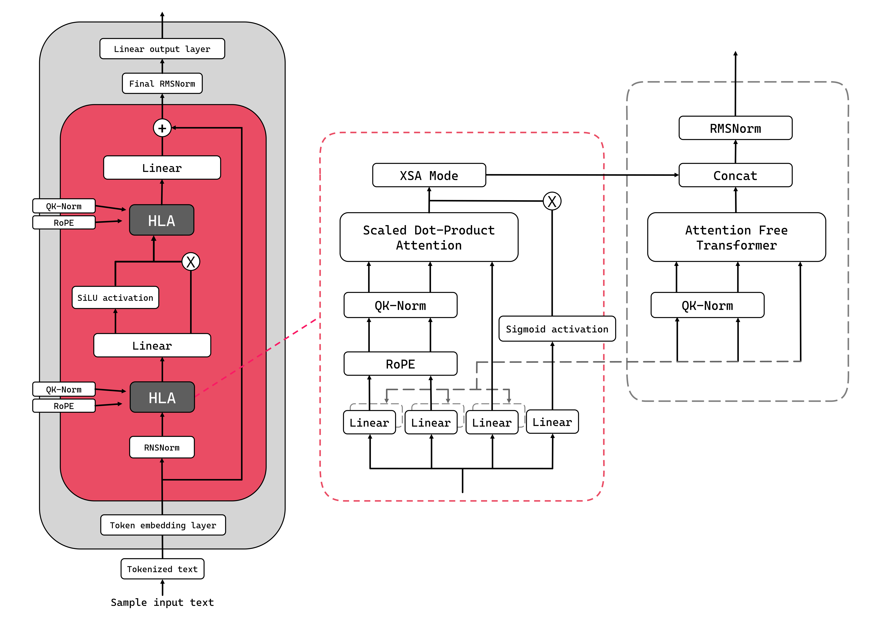
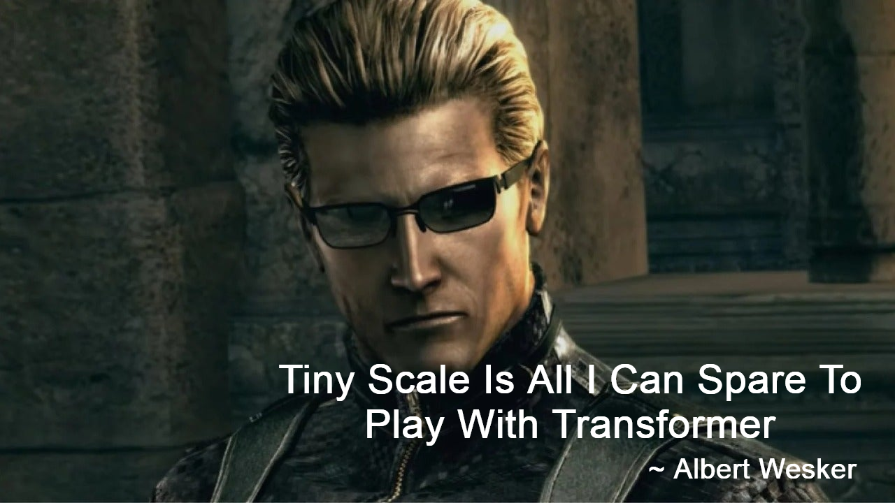

# Tiny Scale Is All I Can Spare To Play With Transformer.
<p align="center">
Srijan Srivastava<br>
India<br>
Srivastavavsrijan321@gmail.com<br>
QCoreNest@gmail.com
</p>

v2, July 2026


## Abstract
Introduction of the Transformer neural network architecture in the famous `Attention Is All You Need` paper has created a huge wave of AI development in recent years. The scaled dot-product attention allows for information to be processed with higher efficiency and quality, which the previous RNN-based models lacked. However Transformer-based models comes with their own set of challenges, particularly with parameter efficiency for tiny scale models. At such tiny scale a Transformer model essentially uses more parameter than it really should. This regime is very under-explored and for good reasons however exploring it might allow us to discover interesting insights about the Transformer. So here-in this paper I am introducing Silia, a novel neural network architecture designed for efficient modelling & classification tasks under severe parameter budget. Training against Andrej Karpathy's nanoGPT, Silia achieves comparable loss and generation quality with significantly less parameters. Along with when a 117M parameters model even after being under-trained on a ~100M tokens of synthetic dataset, Silia achieves losses similar to what scaling loss predict for a Transformer based 117M parameters model trained on ~100M tokens.


## 1. Introduction
The dominant trend in Transformer-based language models has been scaling: larger models, more data, more compute in pre-training and RL for CoT based reasoning capabilities to consistently yield better performance. This means that the smallest practical models such as Qwen, Gemma & GPT-OSS lie anywhere between 1B-20B parameters. Despite them being called "small", these models are still billions in parameters and are trained on trillions of tokens. This trajectory, as useful as it is, has widened the gap between general-purpose frontier research experiments and task-specific small research experiments.

This is where I introduce my neural network architecture which merges the _Attention_ layer with the _SwiGLU Feed Forward_ layer from the Transformer to save lots of parameters while preserving much of the original performance. This new architecture is what I call __Silia__ or __Silu in Attention__. **Silia** aims to reduce the number of parameters per block, especially at much smaller scale (100 million parameters or less) while achieving competitive performance and quality as a standard Transformer.


## 2. Model Architecture


Merging Attention and SwiGLU was inspired from 2 core ideas.

Attention is dynamic and smart about which information to mix, but it has no strong non-linearity to actually transform that information. SwiGLU has the strong non-linearity but it cannot transform input in a way that Attention does.

In Google's PaLM technical report _PaLM: Scaling Language Modeling with Pathways_

instead of doing

$$y = x + MLP(RMSNorm(x + Attention(RMSNorm(x)))$$

the authors did

$$y = x + MLP(RMSNorm(x)) + Attention(RMSNorm(x))$$

and noted 15% faster training speed with small to zero degradation in quality.

### 2.1. Transformer Block
**Attention** is the heart of Transformer and it needs no introduction.

$$Q = XW_Q, K=XW_K, V=XW_V$$

$$A = \mathrm{softmax} \left(\frac{QK^\top}{\sqrt{d_k}} + M\right)V$$

$$\text{Y} = \text{A}W_O \tag{1}$$

Where,

$W_Q \in R^{c \times (d \times h)}$, $W_K \in R^{c \times (d \times h)}$, $W_V \in R^{c \times (d \times h)}$, $W_O \in R^{(d \times h) \times c}$, $M$ is a causal attention mask and $d_k$ is dimension of key matrix.

The above equation is what was introduced in the now famous _Attention Is All You Need_ paper. This is the equation which is used in modern auto-regressive language models like GPT, Claude, Gemini, DeepSeek, Kimi and more.

**SwiGLU** was introduced and used by Google in their (N Shazeer, 2020) paper _GLU Variants Improve Transformer_. Prior to this, the standard Transformer architecture heavily relied on simpler activations like ReLU or GeLU. The paper demonstrated that replacing standard feed-forward network layers with Gated Linear Units (GLUs), specifically those utilizing the _Swish_ activation function (SwiGLU) significantly improved training convergence and downstream model accuracy. Since then SwiGLU has been a popular choice for researchers to use in their Transformer models.

Now here we pass $Y$ from equation $(1)$ into 2 weight matrices,

$$u = YW_u, v = YW_v$$

$$\text{SiLU}(u) = u \odot \sigma(u) = \frac{u}{1 + e^{-u}}$$

$$\text{uv} = \text{SiLU}(u) \odot v$$

$$Y = \text{uv}W_o$$

where,

$W_u \in R^{c \times (4 \times c)}$, $W_v \in R^{c \times (4 \times c)}$, $W_o \in R^{(4 \times c) \times c}$, $\odot$ is the element-wise multiplication operation and $\sigma$ is the $\text{sigmoid}$ activation function.

### 2.2. Hydra Latent Attention (HLA)
Hydra Latent Attention is an attention mechanism which incorporates 5 novel ideas:
- _Exclusive Self Attention (XSA)_ and _Attention Free Transformer (AFT)_ introduced by Apple.
- _Gated Attention_ and _Hydra Head_ introduced by Qwen Team.
- _Multi-Head Latent Attention_ introduced by DeepSeek-AI.

Let $X$ be our hidden state.

$$T = \text{RMSNorm}(X)$$

$$\text{Q}_↓ = TW_{Q↓}, \text{K}_↓ = TW_{K↓}, \text{V}_↓ = TW_{V↓}$$

$$\text{Q}_↑ = QW_{Q↑}, \text{K}_↑ = KW_{K↑}, \text{V}_↑ = VW_{V↑}$$

Where,

$W_{Q↓} \in R^{d_i \times d}$, $W_{K↓} \in R^{d_i \times d}$, $W_{V↓} \in R^{d_i \times d}$, $W_{Q↑} \in R^{d \times (d \times h)}$, $W_{K↑} \in R^{d \times (d \times h)}$ and $W_{V↑} \in R^{d \times (d \times h)}$

The $\text{K}_↓$, $\text{V}_↓$ down projections will be stored in the $\text{KV}$ cache to save memory as proposed by DeepSeek-AI in their paper _DeepSeek-V2: A Strong, Economical, and Efficient Mixture-of-Experts Language Model_. While $\text{Q}_↓$ down projection doesn't contribute in the $\text{KV}$ cache, it does help in reducing the number of parameters due to low-rank factorization.

$$G=TW_G$$

Where $W_G \in R^{d_i \times (d \times \frac{h}{2})}$

The $G$ term was introduced by Qwen Team in their paper _Gated Attention for Large Language Models: Non-linearity, Sparsity, and Attention-Sink-Free_ where they noted performing an element-wise multiplication of the $\text{sigmoid}$ gate with attention results in improved performance of the model along with mitigating the _attention-sink_ problem.

Now this is where things get a little interesting. In another paper by the Qwen Team titled _HydraHead: From Head-Level Functional Heterogeneity to Specialized Attention Hybridization_ they introduced the concept of head-wise Full-Attention (FA) Linear-Attention (LA) hybrid instead of using a layer-wise hybrid which is more commonly used. In HydraHead the authors selected a some heads from $Q$, $K$ and $V$ tensors and allocated to FA which the rest was allocated to FA. This resulted in major reduction in $\text{KV}$ cache along with attention computation.

In the paper the authors used _Gated DeltaNet (GDN)_ as their Linear Attention function however for _Hydra Latent Attention_ I choose to use Apple's _Attention Free Transformer_. There is no concrete and scientific reason behind it. It is purely a design decision mainly due to AFT's quick and simple implementation. We will refer to Attention Free Transformer as $\text{AFT}$ in our mathematical formulation.

Assuming $\text{Q}_↑$, $\text{K}_↑$ and $\text{V}_↑$ has $n$ number of heads where $n$ is a positive integer divisible by 2. are placed in such a way:

$$[H_1, H_2, H_3, H_4, H_5, H_6, H_7, H_8, ..., H_{n-3}, H_{n-2} H_{n-1}, H_n]$$

We break the head dimension in half with an interleaving pattern and assign first half of it to _Exclusive Latent Attention (XLA)_ which is Multi-Head Latent Attention + Gated Attention + Exclusive Self Attention, and the second half to _Apple's Attention Free Transformer ($AFT$)_.

$$\text{QKV-XLA} = [H_1, H_3, H_5, H_7, ..., H_{n-3}, H_{n-1}]$$

$$\text{QKV-AFT} = [H_2, H_4, H_6, H_8, ..., H_{n-2}, H_n]$$

Now we are ready to perform attention.

$$Q_{XLA} = \text{RoPE}(Q_{XLA}), K_{XLA} = \text{RoPE}(K_{XLA}), V_{XLA} = \text{RoPE}(V_{XLA})$$

$$Q_{XLA} = \text{RMSNorm}(Q_{XLA}), K_{XLA} = \text{RMSNorm}(K_{XLA})$$

$$Q_{AFT} = \text{RMSNorm}(Q_{AFT}), K_{AFT} = \text{RMSNorm}(K_{AFT})$$

$$A = \mathrm{softmax} \left(\frac{{Q_{XLA}}{K_{XLA}}^\top}{\sqrt{d_{k_{XLA}}}} + M\right){V_{XLA}}$$

$$O = \text{A} \odot \sigma(G)$$

$$Y_1 = \text{XSA}(O)$$

$$Y_2 = \text{AFT}(Q_{AFT}, K_{AFT}, V_{AFT})$$

Now concatenate both $Y_1$ and $Y_2$ head-wise in the same interleaving manner

$$C = \text{Concat}(Y_1, Y_2)$$

$$Y = \text{RMSNorm}(C)$$

This concatenates our heads from $[H_1, H_3, H_5, H_7, ..., H_{n-3}, H_{n-1}]$, $[H_2, H_4, H_6, H_8, ..., H_{n-2}, H_n]$ back to $[H_1, H_2, H_3, H_4, H_5, H_6, H_7, H_8, ..., H_{n-3}, H_{n-2} H_{n-1}, H_n]$ then applies $\text{RMSNorm}$ to normalize.

### 2.3. Silu in Attention (Silia)
We will use our new __Hydra Latent Attention__ mechanism which reduces the $\text{KV}$ cache along with memory & compute cost. This change was made compared to the original version of Silia which used the standard Multi-Head Attention because an open reviewer pointed out that due to MHA, Silia's memory and compute cost would increase by 2.5x despite the parameter savings, because in Silia we use the attention layer twice in a single block compared to a standard Transformer block where the attention layer was used only once per block.

First we'll calculate attention over our hidden state $X$ where $X \in R^{b \times t \times d}$

$$O = \text{HLA}(X)$$

$$u = OW_u, v = OW_v \tag{1}$$

Where $W_u \in R^{(d \times h) \times d_o}$, $W_v \in R^{(d \times h) \times d_o}$

Now on the 2 outputs $U$ and $V$, we will apply the $\text{SiLU}$ activation function.

$$H = \text{SiLU}(u) \odot v \tag{2}$$

Where $H \in R^{b \times t \times d_o}$

Now in equation $(2)$ we have a non-linear transformation of our hidden state $X$ processed with $HLA$. Now we will pass equation $(2)$ into $HLA$.

$$Y = X + \mathrm{HLA}(H)W_O$$

Where $W_O \in R^{(d \times h) \times d}$ and $Y \in R^{b \times t \times d}$

After passing equation $(2)$ into $HLA$ we take a dot-product of it with an output projection matrix $W_O$ and add our original hidden state $X$ for create a residual connection to ensure rich gradients in deep neural networks similar to Transformer.

## 2. Why Silia
Why do I think replacing linear layers in SwiGLU Feed-forward Network with Attention is a good idea?

Attention as we know is mostly a linear transformation over our hidden state but it isn't simple, regular transformation like Feed-Forward network. We can think of attention as "smart" linear transformation. Such a linear transformation which tells us relevancy of every token, especially at longer sequence lengths. However the attention mechanism lacks a "strong" non-linearity. Attention does use the _softmax_ activation function which is a non-linear activation function but _softmax_ only decides which token attend to which other tokens. This makes _softmax_ a not so "strong" activation function.

SwiGLU feed-forward network however does have a strong activation function which is the _silu_ activation, in-fact at small scales (less parameters and smaller context windows) feed-forward networks such as SwiGLU can approximate exactly what attention does with high accuracy, and this does make sense after all feed-forward networks are _universal function approximators_. However as the model parameters and the context length scales feed-forward networks get worse at approximating the attention mechanism which results in worse performance compared to Transformer.

This is what **Silia** is about. Introducing a new class of feed-forward networks which use attention mechanism for transforming our input and hidden states linearly and using activation functions like _silu_ for transforming that information non-linearly. Instead of running both separately and wasting parameters on overlapping functionality, Silia replaces the static linear matrices in SwiGLU with attention getting dynamic mixing and strong non-linearity in one unified operation.


## 4. Parameter Analysis
### 4.1. Parameters Per Layer In Transformers
In a traditional Transformer the Attention layer has $W_Q$, $W_K$, $W_V$ and $W_O$ matrices, and SwiGLU has $W_u$, $W_v$ and $W_o$ matrices.

Where,

$W_Q \in R^{c \times (d \times h)}$, $W_K \in R^{c \times (d \times h)}$, $W_V \in R^{c \times (d \times h)}$, $W_O \in R^{(d \times h) \times c}$, $W_u \in R^{c \times (4 \times c)}$, $W_v \in R^{c \times (4 \times c)}$, $W_o \in R^{(4 \times c) \times c}$ and $d = \frac{c}{h}$.

Adding all Attention layer shapes,

$$c*(3 \cdot h \cdot d) + (h \cdot d) \cdot c = 4 \cdot c^2 \tag{1}$$

Now add all SwiGLU layer shapes,

$$c \cdot (2 \cdot 4 \cdot c) + (4 \cdot c) \cdot c = 3 \cdot 4 \cdot c^2 \tag{2}$$

Now add equation $(1)$ and $(2)$ together,

$$4 \cdot c^2 + 3 \cdot 4 \cdot c^2 = (4 \cdot c)^2 = 16 \cdot c^2$$

So we have a total of $16 \cdot c^2$ parameters per layer in a traditional Transformer.

### 4.2. Parameters Per Layer In Silia
Unlike Transformer in Silia we merge both Attention and SwiGLU FFN together as discussed above. In Silia we have $W_{Q↓}$, $W_{K↓}$, $W_{V↓}$, $W_{Q↑}$, $W_{K↑}$, $W_{V↑}$, $W_G$, $W_u$, $W_v$ and $W_O$.

Where,

$W_{Q↓} \in R^{d_i \times d}$, $W_{K↓} \in R^{d_i \times d}$ and $W_{V↓} \in R^{d_i \times d}$, $W_{Q↑} \in R^{d \times (d \times h)}$, $W_{K↑} \in R^{d \times (d \times h)}$, $W_{V↑} \in R^{d \times (d \times h)}$, $W_G \in R^{d_i \times (d \times \frac{h}{2})}$, $W_u \in R^{(d \times h) \times d_o}$, $W_v \in R^{(d \times h) \times d_o}$ and $W_O \in R^{(d \times h) \times d}$

Adding all shapes we get,

$$[\frac{h}{2}d^2 + d^2 + 8 \cdot h \cdot d^2] + [(2 \cdot h \cdot d^2 + 4 \cdot d^2 + h \cdot d^2)] + 6 \cdot h \cdot d^2 = [5 + \frac{35}{2} \cdot h] \cdot d^2$$

For simplicity let's switch $\frac{35}{2}$ with $\frac{36}{2}=18$,

$$[5 + \frac{36}{2} \cdot h] \cdot d^2 = [5 + 18 \cdot h] \cdot d^2$$

So we have a total of $[5 + 18 \cdot h] \cdot d^2$ parameters per layer in Silia.

### 4.3. Comparing Parameters Per Layer In Silia & Transformer
Even though it's clear from the above mathematics that the number of parameters per layer in Silia is less than that of the Transformer, we'll still use inequality to prove the same mathematically.

$$[5 + 18 \cdot h] \cdot d^2 < 16 \cdot c^2$$

$$\because d = \frac{c}{h} \implies c = d \cdot h$$

$$[5 + 18 \cdot h] \cdot d^2 < 16 \cdot (d \cdot h)^2$$

$$[5 + 18 \cdot h] \cdot d^2 < 16 \cdot d^2 \cdot h^2$$

$$5 + 18 \cdot h < 16 \cdot h^2$$

This can be rearranged into a quadratic equation,

$$16 \cdot h^2 - 18 \cdot h - 5 > 0$$

Upon solving the quadratic equation we get range for $h$,

$$h < −0.2396$$

$$h > 1.3021​$$

Since $h$ is always a positive integer we can discard and round $1.3021​$ to $2$ resulting in a simple logic that as long as the number of attention heads ($h$) is greater than or equals to $2$ ($h \geq 2$), the number of parameters per layer in Silia will be less than the same of the Transformer.


## 5. Training
### 5.1. Training Data
I trained on Fineweb-edu dataset consisting of about 100M tokens. All the tokens were encoded using byte-pair encoding, which has a shared source-target vocabulary of 8192 token.

For tasks such as memorization, creative writing, math exercise and more I used Synth dataset 100M tokens. This dataset contains approximately 80% English with multilingual content in Spanish, German, French, Polish, Italian, Dutch, Latin and more. All tokens in this dataset were encoded by a separate byte-pair encoder of vocabulary of 8192 tokens.

### 5.2. Hardware
I trained my models on Google Colab and Kaggle's free tier Tesla T4 GPUs. For the base models using the hyperparameters described throughout the paper.

### 5.3. Optimizer
The AdamW optimizer with ${\beta}_1 = 0.9$, ${\beta}_2 = 0.98$ and $\epsilon = 10^{−9}$ was used to train the embedding layers, while the Muon optimizer with $\mu = 95$ was used to train rest of the non-embedding layers.

The learning rate over the course of training, according to the formula:

$$
\eta(t)=
\begin{cases}
\eta_0, & \text{if learning-rate decay is disabled},\\[6pt]
\displaystyle
\eta_0\frac{t+1}{T_w+1},
& 0\le t<T_w,\\[10pt]
\eta_0,
& T_w\le t\le T_c,\\[8pt]
\displaystyle
\eta_{\min}
+\frac{\eta_0-\eta_{\min}}{2}
\left[
1+\cos\!\left(
\pi\frac{t-T_c}{T_d-T_c}
\right)
\right],
& T_c<t\le T_d,\\[12pt]
\eta_{\min},
& t>T_d,
\end{cases}
$$

where,

$$
\begin{aligned}
t &:\ \text{training iteration},\\
\eta_0 &:\ \text{initial learning rate},\\
\eta_{\min} &:\ \text{minimum learning rate},\\
T_w &:\ \text{number of warmup iterations},\\
T_d &:\ \text{total learning-rate decay iterations},\\
c &:\ \text{cooldown fraction},\\
T_c &= (1-c)T_d \quad \text{(start of cosine cooldown).}
\end{aligned}
$$

This corresponds to increasing the learning rate linearly for the first $T_w$ training steps, and decreasing it thereafter using the cosine decay rule as formulated above.


## 6. Results
The idea and intuition is quite simple but it works surprisingly well at tiny scale (≤ 5M parameters) and is able to achieve comparable loss and generation quality to Andrej Karpathy's nanoGPT (with RoPE and SwiGLU) architecture.

I trained 3 different regex+BPE tokenizer based on OpenAI-o200k_base regex pattern.

| Dataset            | Vocabulary size | Tokenizer name |
| ------------------ | --------------- | -------------- |
| Super Tiny WebText | 8192            | cl8k           |
| Fineweb-edu-100M   | 12288           | o12k           |
| Synth-100M         | 16384           | cl16k          |

The first 3 experiments were done with the exact same following settings:

| Hyperparameters                        | Silia | nanoGPT |
| -------------------------------------- | ----- | ------- |
| Context length                         | 256   | 256     |
| Number of layers                       | 2     | 2       |
| Number of heads                        | 4     | 4       |
| Head dimension                         | N/A   | 64      |
| Embedding size                         | 64    | 256     |
| Batch size                             | 16    | 16      |
| Max iterations                         | 10k   | 10k     |
| Max learning rate                      | 3e-3  | 3e-3    |
| Min learning rate                      | 3e-4  | 3e-4    |
| Total parameters (in millions)         | 0.78  | 4.19    |
| Non-embedding parameters (in millions) | 0.26  | 2.09    |

### 6.1. Business Email Generation
Inspired from [Experiment: How far can a 28M model go in business email generation?](https://www.reddit.com/r/LocalLLaMA/comments/1ryq2lg/experiment_how_far_can_a_28m_model_go_in_business/) I trained a business email generation model on [Kamisori-daijin/email-datasets-20k](https://huggingface.co/datasets/Kamisori-daijin/email-datasets-20k) on Hugging Face. There are 20,000 samples of emails and was created using **Gemma 3-4B-it** (via mlx-community/gemma-3-4b-it-4bit-DWQ).

Post-tokenization the dataset had 5.51M tokens, with 80/20 rule I divided it into 4.40M training tokens and 1.10M validation tokens. Both models were trained on 8.2 epochs.

After training the final losses looked like this:

| Loss       | Silia | nanoGPT |
| ---------- | ----- | ------- |
| Training   | 1.43  | 1.4     |
| Validation | 1.48  | 1.44    |

Here's one sample output:
**Prompt: "`Write a polite refusal email<|eop|>`"**

**From the ~28M parameter model**
```
I understand this is a Friday evening, but I'm happy to provide more information.  
I’ll do my best to discuss the details and explore possible alternatives.

We’ll keep you updated on our progress. Please let me know if this is something you’d be interested in.

Best,
[name]
```

**From my model**
```
Correcting Reason for Recent Experience
Dear [Officer's Name],

I hope this email finds you well.

As you know, [Company Name] has recently received your experience with [Product Name], a hugely successful funding round, and we’re committed to providing you with the billing records and targeted a highly value of [Client Name].

As you know, our rebranding initiative is currently undergoing a significant rebranding phase, and we want to sincerely apologize for the timing. We value your time and appreciate your understanding.

We understand your concerns swiftly and want to assure you that we will be moving forward. Please let us know your availability.

Sincerely,
[Name]
Junior Developer
[Company Name]<|eot|>
```

It is still inconsistent but occasionally gets close.

### 6.2. WebText Generation
Trained on my custom [Srijan-Srivastava/super-tiny-webtext](https://huggingface.co/datasets/Srijan-Srivastava/webtext-super-tiny) dataset on Hugging Face. There are 1447 samples and was created by scrapping and cleaning very specific webpages on various topics.

This dataset contain texts from Wikipedia (on various topics, personalities, games, movies, companies and more), fandoms, storylines, scrips and story dialogues of various games (such as GTA, RDR, Last of Us, Mafia, Cyberpunk 2077 and more), transcripts of some YouTube videos, several research papers, academic articles and blogs (mainly revolving around AI and LLMs in general) and code from some of my personal code bases and other public repositories such as the Hazel Game Engine repository on GitHub. I tried my best to keep the programming languages limited to just Python, C#, C++ and JavaScript in the dataset. All of this made ~30M characters in total.

Post-tokenization the dataset had ~9M tokens, with 80/20 rule I divided it into ~7M training tokens and ~2M validation tokens. Both models were trained on 5.8 epochs.

After training the final losses looked like this:

| Loss       | Silia | nanoGPT |
| ---------- | ----- | ------- |
| Training   | 3.46  | 3.15    |
| Validation | 3.85  | 3.44    |

Here's one sample output:
**Prompt: "`Steve Jobs made the soul of Apple`"**
```
Steve Jobs made the soul of Apple and he had a run with Pixar on the company later in a decade I was transported in June 2011, but h e made Jobs was a school case that the company had been accessible to his chairman to fill me named Steve Jobs and Jobs, in the com pany and encounters a $10.5 million in 2022 demanded Apple studio to Apple. In 2023, Jobs announced OpenAI's announcement of the fil m, "Skaxicly that he looks changing the company of the musician, the Macintosh coding virtual businesses but he stated that he wasbl ished for their share of other company. Thing the first Pixar Low and film received a greater of Marvel Studios in US$1.5 million so ld to the board of directors in the late 2011, and the previous release was officially based on funding for the film for launching t he most of the Year. The company's "Didau 16.5 million for the effort to make it a company to frames the company of the Solution, an d having a more access to the company of Apple II. [216] The Wall, Thain,
```

### 6.3. ChatAlpaca Generation
Trained on [ChatAlpaca: A Multi-Turn Dialogue Corpus based on Alpaca Instructions](https://github.com/icip-cas/ChatAlpaca) dataset on Hugging Face. There are 20,000 samples and was created using **GPT-3.5-turbo** to generate follow-up utterances and continue the conversation with ChatGPT. This process results in multi-turn conversations where the simulated user provides instructions and ChatGPT responds accordingly.

Post-tokenization the dataset had ~18M tokens, with 80/20 rule I divided it into ~14.4M training tokens and ~3.6M validation tokens. Both models were trained on 2.8 epochs.

After training the final losses looked like this:

| Loss       | Silia | nanoGPT |
| ---------- | ----- | ------- |
| Training   | 3.35  | 2.98    |
| Validation | 3.4   | 3.41    |

Here's one sample output:
**Prompt: "`Describe the process of decision tree learning.<|eop|>`"**
```
Describe the process of decision tree learning.<|eop|>
Decision tree learning is a supervised machine learning model that uses language, powers, and other machine learning can be used to perform datasets that handle no parsion. Additionally, it would include the test and visualization form of an AI language model. an
AI-powered speech recognition technology that indicate sound quality and meaning. In this sentence, the neural networks, computers c an be used to identify whether the text, while both being used in text. It is more relevant, accurate and more accurate than text an imations or conversational animals and animals. G<|eot|>
```


## 7. Conclusion
### 7.1. Use Cases
1. It can be used as super-light-weight, attention-powered, on-device task-specific models for Smart Watches, old Mobile Phones and several generations old computers.
2. It can be used as on-device models to immediately generate one-linear captions/titles, dialogues for NPCs in video games for increased immersion and more.
3. It can be also be used for simple & fast image/text/topic classification, sentiment/emotion analysis, intent/toxicity detection and more.

### 7.2. Limitations
Silia trains successfully at 100M parameters but whether it'll break at scales beyond 100M parameters is still a thing to be tested.

### 7.3. Closing Thoughts
Silia is a small idea for small scale. The sub-10M parameter space is underexplored and for good reasons, there isn't much glory in it. But I think there's some genuine value in asking whether the standard Transformer block is the right design when you only have a few hundred thousand parameters to spare. Merging attention and SwiGLU into a single unified operation isn't a revolutionary idea, but the parameter savings are real and the results are encouraging enough to be worth sharing. I hope this paper is useful to someone working in the same constrained corner of the field that I am.


## Acknowledgements
This work used compute (for models with 10 million parameters and beyond) sponsored by Tomi Yang. I also thank Tomi Yang for all the helpful discussions!


## References
Andrej Karpathy, (2022). nanoGPT. https://github.com/karpathy/nanogpt.

Ofir Press, Lior Wolf, (2017). Using the Output Embedding to Improve Language Models. _arXiv preprint arXiv:1608.05859_.

Omkar Thawakar, Ashmal Vayani, Salman Khan, Hisham Cholakal, Rao M Anwer, Michael Felsberg, Tim Baldwin, Eric P Xing, Fahad Shahbaz Khan, (2024). Mobillama: Towards accurate and lightweight fully transparent gpt. _arXiv preprint arXiv:2402.16840_.

Zhenzhong Lan, Mingda Chen, Sebastian Goodman, Kevin Gimpel, Piyush Sharma, Radu Soricut, (2019). Albert: Alite bert for self-supervised learning of language representations. _arXiv preprint arXiv:1909.11942_.

Jonathan Frankle, Michael Carbin, (2018). The lottery ticket hypothesis: Finding sparse, trainable neural networks. _arXiv preprint arXiv:1803.03635_.

Benoit Jacob, Skirmantas Kligys, Bo Chen, Menglong Zhu, Matthew Tang, Andrew Howard, Hartwig Adam, Dmitry Kalenichenko, (2018). Quantization and training of neural networks for efficient integer-arithmetic-only inference. _Proceedings of the IEEE Conference on Computer Vision and Pattern Recognition, pages 2704–2713_.

X Ma, J Zhang, R Wang, Q Xu, D Lin, (2019). Tensorized embedding layers for efficient model compression. _Advances in Neural Information Processing Systems_.

Alec Radford, Jeffrey Wu, Rewon Child, David Luan, Dario Amodei, Ilya Sutskever, (2019). Language Models are Unsupervised Multitask Learners. https://cdn.openai.com/better-language-models/language_models_are_unsupervised_multitask_learners.pdf.

Aaron Grattafiori, Abhimanyu Dubey, Abhinav Jauhri, Abhinav Pandey, Abhishek Kadian, Ahmad Al-Dahle, Aiesha Letman, Akhil Mathur, Alan Schelten, Alex Vaughan, Amy Yang, Angela Fan, Anirudh Goyal, Anthony Hartshorn, Aobo Yang, Archi Mitra, Archie Sravankumar, Artem Korenev, Arthur Hinsvark, Arun Rao, Aston Zhang, Aurelien Rodriguez, Austen Gregerson, Ava Spataru, Baptiste Roziere, Bethany Biron, Binh Tang, Bobbie Chern, Charlotte Caucheteux, Chaya Nayak, Chloe Bi, Chris Marra, Chris McConnell, Christian Keller, Christophe Touret, Chunyang Wu, Corinne Wong, Cristian Canton Ferrer, Cyrus Nikolaidis, Damien Allonsius, Daniel Song, Danielle Pintz, Danny Livshits, Danny Wyatt, David Esiobu, Dhruv Choudhary, Dhruv Mahajan, Diego Garcia-Olano, Diego Perino, Dieuwke Hupkes, Egor Lakomkin, Ehab AlBadawy, Elina Lobanova, Emily Dinan, Eric Michael Smith, Filip Radenovic, Francisco Guzmán, Frank Zhang, Gabriel Synnaeve, Gabrielle Lee, Georgia Lewis Anderson, Govind Thattai, Graeme Nail, Gregoire Mialon, Guan Pang, Guillem Cucurell, Hailey Nguyen, Hannah Korevaar, Hu Xu, Hugo Touvron, Iliyan Zarov, Imanol Arrieta Ibarra, Isabel Kloumann, Ishan Misra, Ivan Evtimov, Jack Zhang, Jade Copet, Jaewon Lee, Jan Geffert, Jana Vranes, Jason Park, Jay Mahadeokar, Jeet Shah, Jelmer van der Linde, Jennifer Billock, Jenny Hong, Jenya Lee, Jeremy Fu, Jianfeng Chi, Jianyu Huang, Jiawen Liu, Jie Wang, Jiecao Yu, Joanna Bitton, Joe Spisak, Jongsoo Park, Joseph Rocca, Joshua Johnstun, Joshua Saxe, Junteng Jia et al, (2024). The Llama 3 Herd of Models. _arXiv preprint arXiv:2407.21783_.

Ronen Eldan, Yuanzhi Lim, (2023). TinyStories: How Small Can Language Models Be and Still Speak Coherent English? _arXiv preprint arXiv:2305.07759_.

Srijan Srivastava, (2026). Webtext Super Tiny. https://huggingface.co/datasets/Srijan-Srivastava/webtext-super-tiny.

Kamisori-daijin, (2026). Email datasets 20k. https://huggingface.co/datasets/Kamisori-daijin/email-datasets-20k.

icip-cas, (2023). ChatAlpaca: A Multi-Turn Dialogue Corpus based on Alpaca Instructions. https://github.com/icip-cas/ChatAlpaca.

tatsu-lab, (2023). Stanford Alpaca: An Instruction-following LLaMA Model. https://github.com/tatsu-lab/stanford_alpaca.

codelion, (2025). PleIAs/SYNTH Sampled Dataset (100,000,000 tokens). https://huggingface.co/datasets/codelion/synth-100M.

PleIAs, (2025). SYNTH. https://huggingface.co/datasets/PleIAs/SYNTH.

codelion, (2025). Fineweb-edu-100M. https://huggingface.co/datasets/codelion/fineweb-edu-100M.

HuggingFaceFW, (2025). FineWeb-Edu. https://huggingface.co/datasets/HuggingFaceFW/fineweb-edu.

Aakanksha Chowdhery, Sharan Narang, Jacob Devlin, Maarten Bosma, Gaurav Mishra, Adam Roberts, Paul Barham, Hyung Won Chung, Charles Sutton, Sebastian Gehrmann, Parker Schuh, Kensen Shi, Sasha Tsvyashchenko, Joshua Maynez, Abhishek Rao, Parker Barnes, Yi Tay, Noam Shazeer, Vinodkumar Prabhakaran, Emily Reif, Nan Du, Ben Hutchinson, Reiner Pope, James Bradbury, Jacob Austin, Michael Isard, Guy Gur-Ari, Pengcheng Yin, Toju Duke, Anselm Levskaya, Sanjay Ghemawat, Sunipa Dev, Henryk Michalewski, Xavier Garcia, Vedant Misra, Kevin Robinson, Liam Fedus, Denny Zhou, Daphne Ippolito, David Luan, Hyeontaek Lim, Barret Zoph, Alexander Spiridonov, Ryan Sepassi, David Dohan, Shivani Agrawal, Mark Omernick, Andrew M. Dai, Thanumalayan Sankaranarayana Pillai, Marie Pellat, Aitor Lewkowycz, Erica Moreira, Rewon Child, Oleksandr Polozov, Katherine Lee, Zongwei Zhou, Xuezhi Wang, Brennan Saeta, Mark Diaz, Orhan Firat, Michele Catasta, Jason Wei, Kathy Meier-Hellstern, Douglas Eck, Jeff Dean, Slav Petrov, Noah Fiedel, (2022). PaLM: Scaling Language Modeling with Pathways. _arXiv preprint arXiv:2204.02311_.

Noam Shazeer, (2020). GLU variants improve transformer. _arXiv preprint arXiv:2002.05202_.

Ashish Vaswani, Noam Shazeer, Niki Parmar, Jakob Uszkoreit, Llion Jones, Aidan N. Gomez, Lukasz Kaiser, Illia Polosukhin, (2017). Attention is all you need. _arXiv preprint arXiv:1706.03762_.

Zihan Qiu, Zekun Wang, Bo Zheng, Zeyu Huang, Kaiyue Wen, Songlin Yang, Rui Men, Le Yu, Fei Huang, Suozhi Huang, Dayiheng Liu, Jingren Zhou, Junyang Lin, (2025). Gated Attention for Large Language Models: Non-linearity, Sparsity, and Attention-Sink-Free. _arXiv preprint arXiv:2505.06708_.

Shuangfei Zhai, (2026). Exclusive Self Attention. _arXiv preprint arXiv:2603.09078_.

DeepSeek-AI, (2024). DeepSeek-V2: A Strong, Economical, and Efficient Mixture-of-Experts Language Model. _arXiv preprint arXiv:2405.04434_.

Shuangfei Zhai, Walter Talbott, Nitish Srivastava, Chen Huang, Hanlin Goh, Ruixiang Zhang, Josh Susskind, (2021). An Attention Free Transformer. _arXiv preprint arXiv:2105.14103_.

Zhentao Tan, Wei Chen, Jingyi Shen, Yao Liu, Xu Shen, Yue Wu, Jieping Ye, (2026). HydraHead: From Head-Level Functional Heterogeneity to Specialized Attention Hybridization. _arXiv preprint arXiv:2606.20097_.

DeepSeek-AI, (2026). DeepSeek-V4: Towards Highly Efficient Million-Token Context Intelligence. _arXiv preprint arXiv:2606.19348_.


## Citation

```
@software{Silia,
    author={Srijan Srivastava},
    title={Silia},
    url={https://github.com/SrijanSriv211/Silia},
    version={0.2.0},
    year = {2026}
}
```


